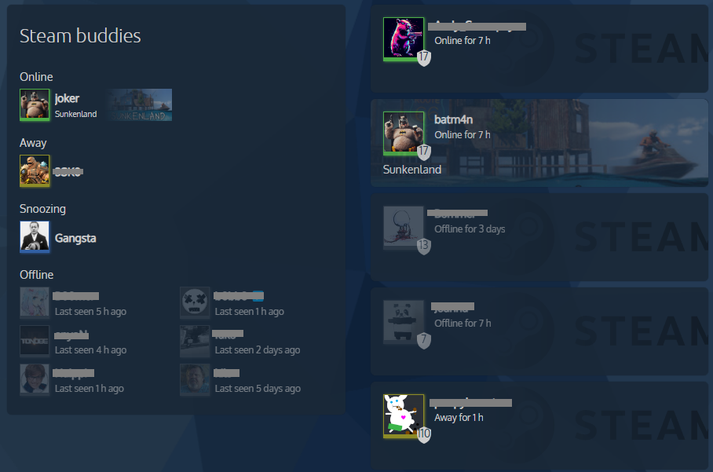

# A compact Steam card by [@jesmak](https://www.github.com/jesmak)

A Home Assistant Lovelace custom card for showing statuses of Steam accounts.

[![GitHub Release][releases-shield]][releases]
[![License][license-shield]](LICENSE.md)
[![GitHub Activity][commits-shield]][commits]

## What is it?

A custom Lovelace card that allows you to easily see what your Steam friends are doing. This card is heavily inspired (and forked from) [kb-steam-card](https://github.com/Kibibit/kb-steam-card) by Kibibit. Kibibit's card hadn't been updated in a few years and I wanted something more compact that would fit nicely in my dashboard, hence, this compact version. Like Kibibit's card, this one also supports a list of Steam entities (displayed in two columns to save vertical space), and single Steam entities. The card is designed so that it will fit nicely in a two column horizontal stack, but will also look nice while displayed in full width.



## Support

Hey dude! Help me out for a couple of :beers: or a :coffee:!

[](https://www.buymeacoffee.com/jesmak)

## Options

| Name                       | Type     | Requirement  | Description                                             | Default             |
| -------------------------- | -------- | ------------ | ------------------------------------------------------- | ------------------- |
| type                       | string   | **Required** | `custom:steam-card-compact`                             |                     |
| entity                     | string[] | **Optional** | Target entities. If only one entity ID is given and auto populate is not enabled, single entity card is rendered instead of the list card. |                     |
| title                      | string   | **Optional** | Title shown on top of card                              | 'Steam Friends'     |
| game_background            | boolean  | **Optional** | Show game header picture as background                  | `true`              |
| auto_populate              | boolean  | **Optional** | If enabled, all sensor.steam_XXXXX entities will be rendered on a list. |               |
| name_overrides             | custom[] | **Optional** | If you want to override the friendly name of some steam users, you can do it with this. |               |

### Format for custom name configs

| Name                     | Type     | Requirement  | Description                                        | Default             |
| ------------------------ | -------- | ------------ | ---------------------------------------------------| ------------------- |
| entity                   | string   | **Required** | The entity to override                             |                     |
| name                     | string   | **Required** | Name shown for this Steam user                     |                     |

### Example configurations


List card for multiple Steam users
```
type: custom:steam-card-compact
entity:
  - sensor.steam_abc
  - sensor.steam_def
  - sensor.steam_ghi
  - sensor.steam_jkl
  - sensor.steam_mno
title: Steam buddies
name_overrides:
  - entity: sensor.steam_abc
    name: ABC-MAN
  - entity: sensor.steam_jkl
    name: Testing
```

Big card for single Steam user
```
type: custom:steam-card-compact
entity:
  - sensor.steam_abc
```

List card with all Steam users
```
type: custom:steam-card-compact
auto_populate: true
```

## How to install

### With HACS

1. Add this repository to HACS custom repositories
2. Search for Steam Card Compact in HACS and install with type Lovelace
3. Refresh your browser

### Manually

1. Download steam-card-compact.js from latest release and copy it to config/www folder on your Home Assistant installation.
2. In Home Assistant settings, open dashboards, click the 3 dots button on the top right of the screen and open resources
3. Add a new resource with path /local/steam-card-compact.js (type JavaScript)
4. Refresh your browser

[commits-shield]: https://img.shields.io/github/commit-activity/y/jesmak/steam-card-compact.svg?style=for-the-badge
[commits]: https://github.com/jesmak/steam-card-compact/commits/main
[license-shield]: https://img.shields.io/github/license/jesmak/steam-card-compact.svg?style=for-the-badge
[releases-shield]: https://img.shields.io/github/release/jesmak/steam-card-compact.svg?style=for-the-badge
[releases]: https://github.com/jesmak/steam-card-compact/releases
